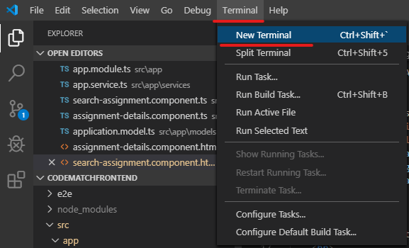
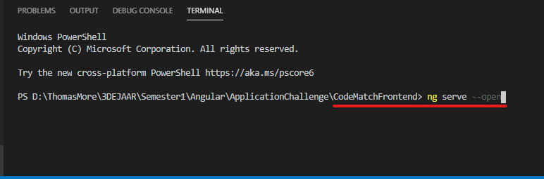

# Application challenge: MatchIT

## Project description

The assignment application challenge 2019 organized by the Grasshoppers Academy. Is a challenge made for students in their last year of the IT-Factory. The assignment, “The Matchmaking System”, is platform designed for students, interns or any other person who does IT in his spare time. The goal is to bring these people in contact with companies that have “not so urgent” assignments, but they still want to have looked at.

A couple examples would be: Designs, Websites, Applications, Data modeling, …

## Team: CodeMatchers (Athene)

This assignment wasn’t made for one student to complete, but for a team of students. Our team the “CodeMatchers” consists of 4 students. together we build our application "MatchIT".
  * Bosz Srisan (BoszS)
  * Brecht Snoeck (BrechtSnoeck)
  * Maarten Schroons (maartenschroons)
  * Stijn Haerkens (stijnhhh)

## What's in this Repo?

In this repository you can find the frontend that we made for the application challenge. The application challenge is closely linked to our course Angular, so naturally we had to pick Angular to develop our frontend.  The frontend isn’t hosted anywhere, so you’ll have to clone into this repo to get started!  --> more information ahead! 

## Installation

Before you clone/download this repo, you might want to make sure that your development environment is in order. 

* First you’ll need an IDE. Personally we like using Visual Studio Code. But other IDEs like Webstorm, Angular IDE, Atom editor, … are good choices. If u want to download VSC, click the following link: https://code.visualstudio.com/

* Second of all you will need Node.js (version 10.9.0 or later). You can download Node.js using the following link https://nodejs.org/en/. 
  * Once installed you can check your current version with: run ‘node -v’ in a terminal/console. 
  * Npm package manager is installed together with Node.js. You can check the current version with: run ‘npm -v’ in terminal/console.

* Lastly this project was generated with [Angular CLI](https://github.com/angular/angular-cli) version 8.1.1. In order to make sure that you can deploy the project, make sure to run the following command to install the angular cli:
  * “npm install -g @angular/cli@8.1.1” in a terminal/console.

## Development

In order to deploy the application, you can use the terminal inside your IDE.

 
 
Run `ng serve --open` for a dev server. Navigate to `http://localhost:4200/`. The app will automatically reload if you change any of the source files.

 

 ## Backend
 
 Want to have a look at what the backend looks like? Just click on the following link!
 https://github.com/BoszS/CodeMatchBackend
